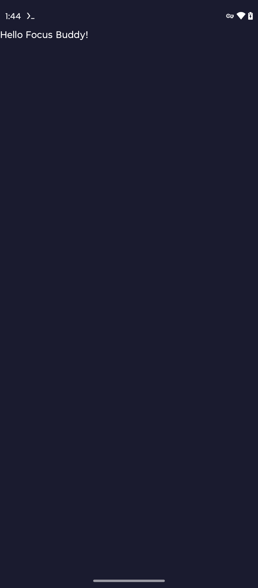

# Focus Buddy

A minimal, beautiful Pomodoro timer with glassmorphism UI, haptic feedback, and smooth animations.



## Features

- **Elegant Timer**: Large, bold countdown with animated progress ring
- **Glassmorphism Design**: Modern translucent UI with smooth gradients
- **Haptic Feedback**: Tactile responses for all interactions
- **Customizable**: Adjust focus/break durations and session labels
- **Fully Offline**: No internet required, no data collection

## Tech Stack

- **Language**: Kotlin
- **UI**: Jetpack Compose with Material3
- **Architecture**: MVVM + Repository Pattern
- **DI**: Hilt
- **Storage**: DataStore (preferences)
- **Min SDK**: 26 (Android 8.0)
- **Target SDK**: 34 (Android 14)

## Development

### Building

```bash
ANDROID_HOME=~/android-sdk ./gradlew assembleDebug
```

APK location: `app/build/outputs/apk/debug/app-debug.apk`

### Project Structure

```
app/src/main/java/com/giruai/focusbuddy/
├── di/              # Hilt modules
├── data/            # Data layer (DataStore, Repository)
├── domain/          # Domain models
├── ui/              # Compose screens & components
│   ├── timer/       # Timer screen
│   ├── settings/    # Settings screen
│   ├── components/  # Reusable UI components
│   ├── theme/       # Colors, typography, theme
│   └── navigation/  # Navigation graph
└── util/            # Utilities (haptics, etc.)
```

## Sprint Status

**Current Sprint**: Sprint 1 — Foundation

| Story | Status | Description |
|-------|--------|-------------|
| story-001 | ✅ Done | Android project structure |
| story-002 | ✅ Done | Hilt dependency injection |
| story-003 | ✅ Done | Navigation & theme |
| story-004 | ✅ Done | Timer logic |
| story-005 | ✅ Done | Progress ring animation |
| story-006 | ✅ Done | Timer screen UI |
| story-007-012 | 📋 Planned | Settings, haptics, polish |

## License

© 2026 Giru AI. All rights reserved.
